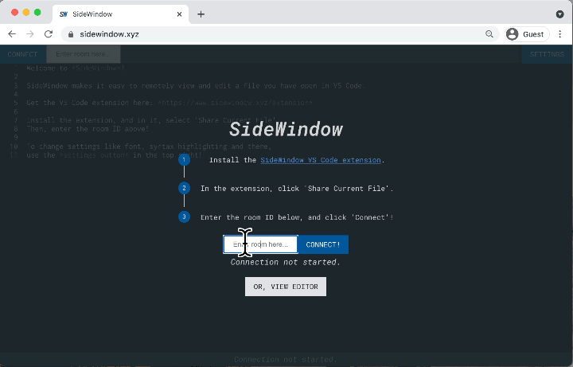

# Projects & Creations
Things by me.

## SideWindow @ [sidewindow.xyz](https://www.sidewindow.xyz)

[SideWindow](https://www.sidewindow.xyz) is an application that lets you cast your editor contents to any other device for remote viewing and editing.

I built SideWindow because I work on my laptop a lot, and wanted to be able to use my phone as a second monitor.

Install the SideWindow extension in VS Code, then you're good to go! Use the browser client to view from anywhere.

Check it out at [sidewindow.xyz](https://www.sidewindow.xyz)! The extension repo can be found [here](https://github.com/alextobias/sidewindow-extension), and the browser client repo can be found [here](https://github.com/alextobias/sidewindow).

## Tweet Sentiment Predictor @ [link here](http://alextobias.me/sentiment-analysis-web/predict-sentiment.html)

I used [fasttext](https://fasttext.cc/) to train a text classification model on the [Sentiment140](https://www.kaggle.com/kazanova/sentiment140) dataset of 1.6 million tweets.

The model performs classification on input text to predict its sentiment as positive or negative, with an additional measure of confidence.

What's extra cool is that it's actually all running client-side, no external API requests needed. I was able to compile fasttext to WebAssembly so that the model is loaded and all work is done in your browser. 

[Try it out here!](http://alextobias.me/sentiment-analysis-web/predict-sentiment.html)

## Part-of-Speech Tagger

I implemented a part-of-speech tagger that works by being trained on pre-tagged texts (such as from a corpus). It's able to tag familiar and unfamiliar texts with 85-90% accuracy.

The tagger works by generating a Hidden Markov Model on its training dataset to look at both observation/emission and transition/sequential probabilities.

I found [this resource](https://web.stanford.edu/~jurafsky/slp3/8.pdf) invaluable in understanding the concepts behind Hidden Markov Models in the context of language processing.

